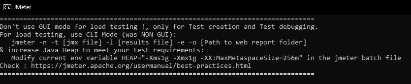

## Correr un server de JMETER en Docker

El siguiente proyecto tiene como objetivo correr un servidor de JMETER en un contenedor de Docker. y de correr un plan de pruebas en el servidor de JMETER.


Este proyecto corre un servidor de JMETER en un contenedor de Docker, y corre un plan de pruebas previamente creado en la GUI.

Tener en cuenta que esto se hace de acuerdo a lo sugerido por la documentación oficial de JMETER.

<div align="center">
  
</div>
<br>

### Requisitos

- Docker
- Docker-compose
- Plan de pruebas de JMETER en formato .jmx con los plugins necesarios

---

### Ejecución Rapida

Para correr pruebas de acuerdo a un plan creado en la GUI de JMETER, ejecute el script `generate-test.sh` ubicado en la carpera de `jmeter_scripts` con el siguiente comando:

```bash
./generate-test.sh ./First.jmx scenario 100 10
```
Los parametros corresponden a: 
- `./First.jmx` : Ruta del archivo de plan de pruebas .jmx
- `scenario` : Nombre del escenario de pruebas en el que se guardarán los resultados de cada iteración
- `100` : Cantidad de hilos a simular (threads)
- `10` : Aceleración de la prueba (s)


 >  Tenga en cuenta que necesita los siguientes plugins para correr las pruebas, estos estan configurados en la imagen de Dockerfile:
 >   - GRAPHS GENERATOR LISTENER
 >   - PERFMON (SERVERS PERFORMANCE MONITORING)
 >   - COMMAND-LINE GRAPH PLOTTING TOOL
 >   - 3 BASIC GRAPHS - Average Response Time - Active Threads - Successful/Failed Transactions
 >   - 5 ADDITIONAL GRAPHS - Response Codes- Bytes Throughput - Connect Times - Latency - Hits/s
 >   - Synthesis Report
 >   - Filter Results Tool


---

### Instrucciones para correr pruebas de JMetercon el cli

```bash
jmeter -n -t <path_to_jmx_file> -l <path_to_output_file> 
```

> Asegurese de que el archivo de resultados o salida no exista


### Generar reporte de resultados HTML

```bash
jmeter  -g <path_to_output_file>  -o <path_to_folder_empty>
```


----
## Construir el proyecto con docker

Para construir el proyecto con docker, se debe ejecutar el siguiente comando:


```bash
docker build -t jmeter-test .
```

### Correr docker sin que se cierre

Para correr el contenedor de docker sin que se cierre, se debe ejecutar el siguiente comando:

```bash
 docker run -d -p 6000:6000 jmeter-test  tail -f /dev/null    
```
### Buscar el id del contenedor de docker

Para buscar el id del contenedor de docker, se debe ejecutar el siguiente comando:

```bash
docker ps
```

### Ingresar al contenedor de docker con SH

Para ingresar al contenedor de docker con SH, se debe ejecutar el siguiente comando:

```bash
docker exec -it <container_id> sh
```

### Detener contenedor docker

Para detener el contenedor de docker, se debe ejecutar el siguiente comando:

```bash
docker stop <container_id>
```
---

## Ejecutar pruebas de JMeter

Para ejecutar las pruebas de JMeter, se debe ejecutar el siguiente comando:

```sh
jmeter -n -t <path_to_jmx_file> -l <path_to_output_file>
```

 > El archivo `.jmx` es el plan de pruebas que se desea ejecutar. El archivo `.jtl` es el archivo donde se guardaran los resultados de las pruebas. el archivo de salida siempre deberá ser de extensión `.jtl`. ejemplo `jmeter -n -t test.jmx -l results.jtl`


---

## Ejcutar JMeterPluginsCMD

Para ejecutar JMeterPluginsCMD, se debe ejecutar el siguiente comando:

```bash
./JMeterPluginsCMD.sh --generate-png <path_to_output_file> --input-jtl <path_to_output_folder>
```


## ResponseTimesOverTime

Este grafico muestra la evolución de los tiempos de respuesta a lo largo del tiempo.

```bash
.\JMeterPluginsCMD.bat --generate-png responseTimesOverTime.png --input-jtl \jmeter\first-results.jtl --plugin-type ResponseTimesOverTime --width 800 --height 600
```

Contenedor

```sh
JMeterPluginsCMD.sh  --generate-png responseTimesOverTime.png --input-jtl result.csv --plugin-type ResponseTimesOverTime --width 800 --height 600
```

## TransactionsPerSecond

Este grafico muestra la cantidad de transacciones por segundo.

```bash
.\JMeterPluginsCMD.bat --generate-png transactionPerSecond.png --input-jtl \jmeter\first-results.jtl --plugin-type TransactionsPerSecond --width 800 --height 600
```

Contenedor

```sh
JMeterPluginsCMD.sh  --generate-png transactionPerSecond.png --input-jtl result.csv --plugin-type TransactionsPerSecond --width 800 --height 600
```

## ThreadsStateOverTime

Este grafico muestra la cantidad de hilos activos a lo largo del tiempo.

```bash
.\JMeterPluginsCMD.bat --generate-png activeThreadsOverTime.png --input-jtl \jmeter\first-results.jtl --plugin-type  ThreadsStateOverTime --width 800 --height 600
```

Contenedor

```sh
JMeterPluginsCMD.sh  --generate-png activeThreadsOverTime.png --input-jtl result.csv --plugin-type ThreadsStateOverTime --width 800 --height 600
```

## LatenciesOverTime

Este grafico muestra la evolución de las latencias a lo largo del tiempo de las peticiones.

```bash
.\JMeterPluginsCMD.bat --generate-png latenciesOverTime.png --input-jtl \jmeter\first-results.jtl --plugin-type LatenciesOverTime --width 800 --height 600
```

Contenedor

```sh
JMeterPluginsCMD.sh  --generate-png latenciesOverTime.png --input-jtl result.csv --plugin-type LatenciesOverTime --width 800 --height 600
```

## HitsPerSecond

Este grafico muestra la cantidad de hits por segundo.

```bash
.\JMeterPluginsCMD.bat --generate-png hitsPerSecond.png --input-jtl \jmeter\first-results.jtl --plugin-type HitsPerSecond --width 800 --height 600
```

Contenedor

```sh
JMeterPluginsCMD.sh  --generate-png hitsPerSecond.png --input-jtl result.csv --plugin-type HitsPerSecond --width 800 --height 600
```

## BytesThroughputOverTime

Este grafico muestra la cantidad de bytes transferidos a lo largo del tiempo.

```bash
.\JMeterPluginsCMD.bat --generate-png bytesThroughputOverTime.png --input-jtl \jmeter\first-results.jtl --plugin-type BytesThroughputOverTime --width 800 --height 600
```

Contenedor

```sh
JMeterPluginsCMD.sh  --generate-png bytesThroughputOverTime.png --input-jtl result.csv --plugin-type BytesThroughputOverTime --width 800 --height 600
```


## AggregateReport

Este archivo `.csv` muestra un resumen de los resultados de las pruebas.

```bash
.\JMeterPluginsCMD.bat --generate-csv \jmeter\aggregatingReport.csv --input-jtl \jmeter\first-results.jtl --plugin-type AggregateReport
```

Contenedor

```sh
JMeterPluginsCMD.sh  --generate-csv aggregatingReport.csv --input-jtl report.jtl --plugin-type AggregateReport
```

 > Si se ejecuta en el contenedor, debe de cambiar `.\JMeterPluginsCMD.bat` por `JMeterPluginsCMD.sh` y los resultados para generar el gráfico se hacen con el archivo csv.

## Performance

Generar un grafico de la utilización de la CPU y la memoria.

```bash
.\JMeterPluginsCMD.bat --generate-png performance.png --input-jtl \jmeter\first-results.jtl --plugin-type PerfMon --width 800 --height 600
```

Contenedor

```sh
JMeterPluginsCMD.sh  --generate-png performance.png --input-jtl result.csv --plugin-type PerfMon --width 800 --height 600
```


# Ejecutar Script de generar reporte

Para ejecutar el script de generar reporte de los comandos anteriores, se debe ejecutar el siguiente comando:

```sh
./generate-graphs.sh <nombre_carpeta> <performance.csv> <archivo.csv>
```

 > El archivo `generate-results.sh` se encuentra en la carpeta `jmeter-results`. Se debe proporcionar el nombre de la carpeta donde se guardaran los resultados y el archivo `.jtl` o `.csv` que se genero al ejecutar las pruebas.

 > EJEMPLO: sh generate-graphs.sh resultados_prueba results.jtl


## Agente de Performance

Acerca del Agente [Readme](https://github.com/undera/perfmon-agent)

Instalarlo en el contenedor

```sh
curl -L -o /tmp/ServerAgent-2.2.3.zip https://github.com/undera/perfmon-agent/releases/download/2.2.3/ServerAgent-2.2.3.zip && /
unzip -q /tmp/ServerAgent-2.2.3.zip  -d /jmeter/server-agent && rm /tmp/ServerAgent-2.2.3.zip && /
./server-agent/ServerAgent-2.2.3/startAgent.sh --udp-port 0 --tcp-port 4444
```
 
Conocer la ip del contenedor por medio de su id

```sh
docker ps
docker inspect -f '{{range .NetworkSettings.Networks}}{{.IPAddress}}{{end}}' <id_contenedor>           
```